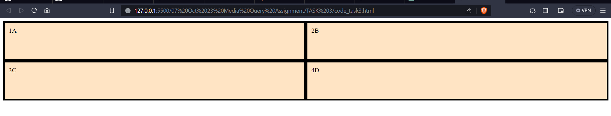
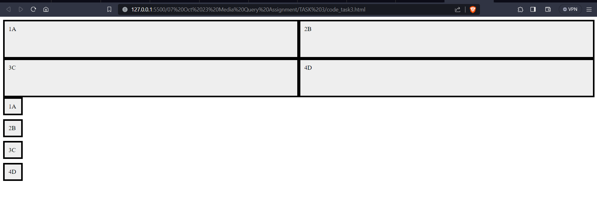

# SOLUTION TASK 3
 Explain the use of grid-auto-row and grid-auto-column using code examples

### `grid-auto-row`

The `grid-auto-row` property is used to set the size of rows that are not explicitly defined in the grid. This property is particularly useful when you have a grid with a fixed number of columns but an unknown number of rows.
example 
 ### `OUTPUT`` IMAGE` 



### `grid-auto-column`

The `grid-auto-column` property is used to set the size of columns that are not explicitly defined in the grid. This property is particularly useful when you have a grid with a fixed number of columns but an unknown number of columns.
# output 



```css
.container {
  display: grid;
  grid-template-columns: 1fr 1fr;
  grid-auto-rows: 100px; /* Set the height of automatically generated rows */

.item {
  border: 1px solid black;
  padding: 10px;
}

}

```html
<!DOCTYPE html>
<html lang="en">
<head>
  <meta charset="UTF-8">
  <meta name="viewport" content="width=device-width, initial-scale=1.0">
  <title>grid-auto-row Example</title>
  <link rel="stylesheet" href="styles.css">
</head>
<body>
  <div class="container">
    <div class="item">1</div>
    <div class="item">2</div>
    <div class="item">3</div>
    <div class="item">4</div>
    <div class="item">5</div>
    <div class="item">6</div>
    <div class="item">7</div>
    <div class="item">8</div>
  </div>
</body>
</html>


example `grid-auto-column`
```css
.container {
  display: grid;
  grid-template-columns: 1fr 1fr;
  grid-auto-columns: 100px; /* Set the height of automatically generated columns */

.item {
  border: 1px solid black;
  padding: 10px;
}

}

```html
<!DOCTYPE html>
<html lang="en">
<head>
  <meta charset="UTF-8">
  <meta name="viewport" content="width=device-width, initial-scale=1.0">
  <title>grid-auto-column Example</title>
  <link rel="stylesheet" href="styles.css">
</head>
<body>
  <div class="container">
    <div class="item">1</div>
    <div class="item">2</div>
    <div class="item">3</div>
    <div class="item">4</div>
    <div class="item">5</div>
    <div class="item">6</div>
    <div class="item">7</div>
    <div class="item">8</div>
  </div>
</body>
</html>


