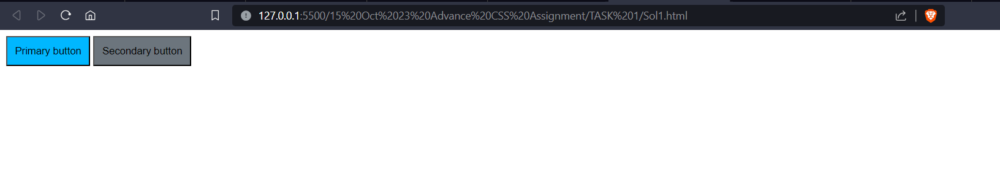

# Solution 1 Using the `var()` Function in CSS


## Using the `var()` Function in CSS

In Cascading Style Sheets (CSS), the `var()` function is employed to define and use custom properties, also known as CSS variables. CSS variables allow you to store values and reuse them throughout your stylesheet, offering a more modular and maintainable approach to styling.

### Purpose of `var()`

The `var()` function is utilized to insert the value of a CSS variable wherever it is called. This promotes consistency in design by enabling you to update a variable's value in one place, affecting all instances where it is referenced.

### Syntax

The basic syntax of the `var()` function is as follows:

```css
var(--variable-name, [fallback-value]);

:root{
            --content-bacground-color:#00b7ff;
            --content-bg-col:#6c757d;
        }

        #primaryBtn{
            background-color: var(--content-bacground-color) ;
            padding: 10px;
        }

        #secondaryBtn{
            background-color: var(--content-bg-col);
            padding: 10px;
        }
```
# OUTPUT IMAGE AND CODE 

