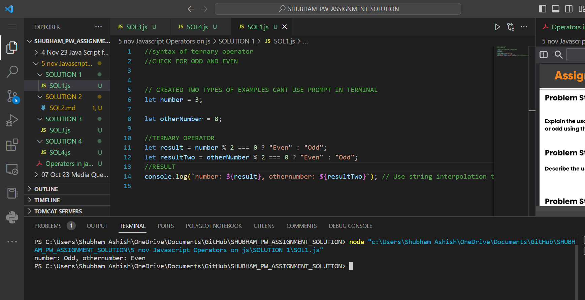

# PROBLEM STATEMENT 1 OUTPUT

# Ternary Operator in JavaScript

The ternary operator, also known as the conditional operator, provides a concise way to express a simple conditional statement in a single line. It is often used for short and straightforward assignments based on a condition.

## Syntax:
### Ternary operator

```javascript
let result = (condition) ? trueValue : falseValue;
```

### Nested Ternery Operator
```javascript
let result;
if (condition) {
  result = trueValue;
} else {
  result = falseValue;
}
```

