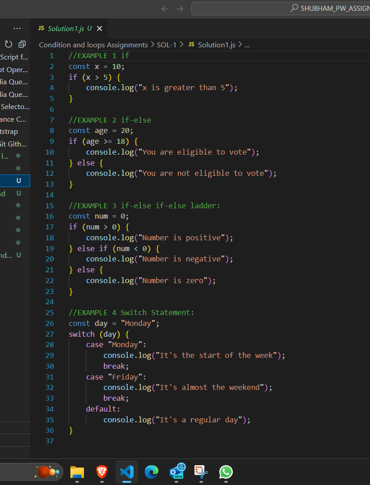

## Q1. What are conditional statements? Explain conditional statements with syntax and examples

## Conditional Statements
- Conditional statements in programming are structures that allow the execution of certain code blocks based on specified conditions. They help control the flow of a program by enabling different paths for different situations.

## Syntax
### 1.if Statement :
```javascript
if (condition) {
    // Code to be executed if the condition is true
}
```

### 2.if-else Statement:
```javascript
if (condition) {
    // Code to be executed if the condition is true
} else {
    // Code to be executed if the condition is false
}
```


### 3. if-else if-else Statement:
```javascript
if (condition1) {
    // Code to be executed if condition1 is true
} else if (condition2) {
    // Code to be executed if condition2 is true
} else {
    // Code to be executed if none of the conditions are true
}
```


### 4. Switch Statement:
```javascript
switch (expression) {
    case value1:
        // Code to be executed if expression is equal to value1
        break;
    case value2:
        // Code to be executed if expression is equal to value2
        break;
    // ... additional cases
    default:
        // Code to be executed if none of the cases match
}
```


- Conditional statements are crucial for creating flexible and responsive code that adapts to different scenarios.

## Example OUTPUT 1
